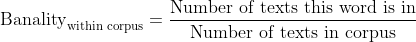
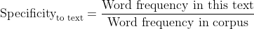
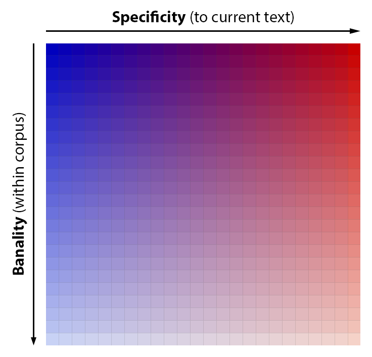
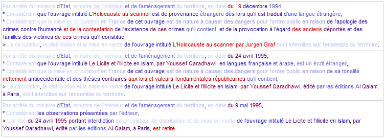

# Retrieve decrees and highlight differences

## Principles

*This repository is part of a wider study about french legislative processes.*

Legal documents can be a headache: tons of pages of jargon considerations. From a digital social sciences perspective, we could help ourselves a bit on those matters.

Therefore, this project has two main and consecutive sides:

- Scrap data from the web
- Visualize data correctly

A sister project of the present one can be found [here](https://github.com/Tayflo/gas-scrapAN-compare).

## Description

The idea of the present project is to highlight differences between very similar texts, such as decrees of a specific kind.

For each word, in each text, two metrics are computed: "Banality" (on corpus level) and  "Specificity" (on text level). (Note that is similar to a [term frequency-inverse document frequency](https://en.wikipedia.org/wiki/Tf%E2%80%93idf) analysis.)

Formulas used here are the following:

<!-- @see https://www.codecogs.com/latex/eqneditor.php -->
<!-- To negate in dark themes, use style="filter:invert(1)" -->
<!-- \textup{Banality}_{\textup{within corpus}} = \frac{\textup{Number of texts this word is in}}{\textup{Number of texts in corpus}} -->

  

<!-- \textup{Specificity}_{\textup{to text}} = \frac{\textup{Word frequency in this text}}{\textup{Word frequency in corpus}} -->

  

Colors are given accordingly:

  

Which gives us, for an extract of some censorship decrees:

  

## Licence and Re-use

This personal project was part of a broader specific work, hence it has not been designed for easy straightforward re-use, neither for further developments.

- If it can ever serve educational purposes as it is, it's great.

- If you plan to draw inspiration from the present work and its methods, citation in your own work is always appreciated. If needed, you can also open an issue or [contact me](tayflooooo@gmail.com).

- If you are interested in analyzing lawmaking, the GitHub organization [Regards Citoyens](https://github.com/regardscitoyens) could be the right place for you.

All underlying dependencies of the project can be found in [package.json](package.json), and when needed references are within the source code.
